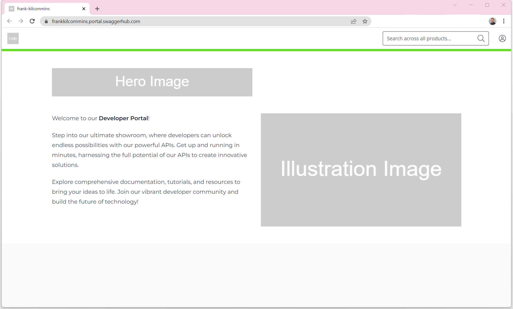
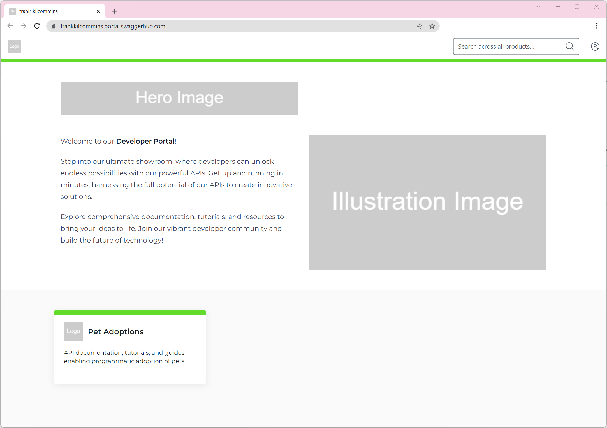
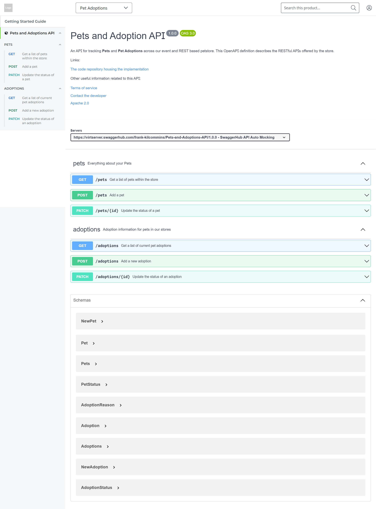

# SwaggerHub-Portal-Management

This ReadMe demonstrates how to configure and manage a SwaggerHub Portal instance directly via its administrative APIs. 

## Prerequisites
 - A software as a service (SaaS) enterprise plan with SwaggerHub. If required, obtain a trial license from https://try.smartbear.com/.
 - A `designer` or `owner` role within the SwaggerHub organization.
 - SwaggerHub Portal enabled for the SwaggerHub organization (from above).

 ## Base Info
 
 Base URL Endpoint: The SwaggerHub Portal API base endpoint is `https://api.portal.swaggerhub.com/v1`.
 Security: Authenticated requests must provide a SwaggerHub API key via the HTTP Authorization header.


 ## Use Cases

 The following use cases are covered:
 1. Manage Portal Settings (appearance, logos, fonts, etc.)
 2. Create and publish new Product
 3. Add APIs and Documentation to a Product
 4. Manage existing Products
 5. Get overview of published content

 Other goals/tasks ()
 - Harden the Portal API OpenAPI document

### File structure

- images - all images for the portal configuration
- manifest - contains metadata for the portal settings
- products - contains all products to be configured
  - product_1 - contains all data relevant to Product1
    - *.md files - contains the markdown documents to be published
    - images folder - all images relevant to the Product (or referenced from the md files)
    - manifest - links to the APIs that will be added to the Product 1
  - product_2 ...
  - product_N


## Use Case 1 - Manage Portal Settings

The following section describes how to configure a portal instance via its administrative APIs.

The portal settings mainly control the branding, name, domain url, and availability of a portal. These settings are split into three levels: `general`, `branding`, and `landingPage`.

The following table outlines the settings per level
| Level      | Setting Name | Description |
| ----------- | ----------- | ----------- |
| root | `name` | The name of the portal instance |
| root | `subdomain` | The subdomain name to be prefixed onto the portal domain: `https://<SUBDOMAIN>.portal.swaggerhub.com/` |
| root | `offline` | Determines if the portal is offline and inaccessible to customers |
| branding | `faviconId` | A reference to the favicon attachment. *Note*  A _favicon_ must be 16x16 pixels, have a `.ico`, `.gif`, or `.png` file format, and be less than 5MB in size. |
| branding | `logoId` | A reference to the logo attachment. *Note*  A _logo_ must be 64x64 pixels, have a `.jpg`, `.gif`, or `.png` file format, and be less than 5MB in size. |
| branding | `fontName` | The font to use for the portal landing page and for all product pages. Support fonts are `Open Sans`, `Montserrat`, `Roboto`, `Playfair Display`, `Lato`, or `Merriweather`. |
| branding | `accentColor` | A hexidecimal color value to use for the accent color of the landing page and all product pages.
| landingPage | `heroImageId` | A reference to the hero image attachment. *Note*  A _hero_ image can be up to 566 x 80 pixels, have a `.jpg`, or `.png` file format, and be less than 5MB in size. |
| landingPage | `illustrationImageId` | A reference to the illustration image attachment. *Note*  An _illustration_ image should be at least 566 x 320 pixels, with a 16:9 aspect ratio, have a `.jpg`, or `.png` file format, and be less than 5MB in size. |
| landingPage | `pageDescription` | A short description for the portal landing page (upto 500 characters long). Markdown format supported.

### Retrieve the base information of your portal

To obtain the basic information on your portal instance, you should send a request to `https://api.portal.swaggerhub.com/v1/organizations?subdomain=<YOUR-CONFIGURED-DOMAIN>`

Sample cURL request:
```
curl --location 'https://api.portal.swaggerhub.com/v1/portals' \
--header 'Authorization: Bearer <YOUR-SWAGGERHUB-APIKEY>'
```

> Keep the response to hand as you'll use some of the data to update the portal-settings.json file as well as make addition API calls.

### Upload branding and landing images
The `logo`, `hero`, `illustration`, and `favicon` files can be uploaded via  `POST` requests to the `/attachments/branding/{portalId}?name={imageName}` endpoint.

> Don't forget to replace the placeholders in the sample request with real values
Sample cURL request:
```
curl -X POST -H "Content-Type: image/png" --data-binary "@fav.png" https://api.portal.swaggerhub.com/v1/attachments/branding/<YOUR-PORTALID>?name=<IMAGE-NAME> \
--header 'Authorization: Bearer <YOUR-SWAGGERHUB-APIKEY>'
```
> Keep the response to hand as you'll use some of the data to update the portal settings shortly


### Update the Portal Settings

Portal settings can be updated via a `PATCH` request to the `/portals/{portalId}` endpoint.

Below is a sample _request body_ which can be supplied with the request. The details on the properties can be found in the settings table above or via the [API docs](LINK TO DO). 

> don't forget to replace the placeholder values with the real values you obtained from the previous API calls
```
{
  "name": "<The Portal Name>",
  "subdomain": "<The subdomain for the Portal>",
  "offline": false,
  "landingPage": {
    "heroImageId": "<The id of the hero image attachment>",
    "illustrationImageId": "<The id of the illustration image attachment>",
    "pageDescription": "<A description of what the portal is for you customers (max 500 characters)>"
  },
  "branding": {
    "faviconId": "<The id of the favicon attachment>",
    "logoId": "<The id of the logo attachment>",
    "fontName": "<The fontname to use for portal>",
    "accentColor": "<The hexidecimal value for the accent color>"
  }
}
```

Sample cURL request:
```
curl --location --request PATCH 'https://api.portal.swaggerhub.com/v1/portals/<YOUR-PORTALID>' \
--header 'Authorization: Bearer <YOUR-SWAGGERHUB-APIKEY>' \
--header 'Content-Type: application/json' \

--data '{
    "name": "frank-kilcommins",
    "subdomain": "frankkilcommins",
    "offline": false,
    "landingPage": {
        "heroImageId": "42a69117-fc45-4cdd-b9be-a9bdb3779e48",
        "illustrationImageId": "0d4f20a1-d38d-433d-8272-38453bbcb45e",
        "pageDescription": "Welcome to our Developer Portal! Step into our ultimate showroom, where developers can unlock endless possibilities with our powerful APIs. Get up and running in minutes, harnessing the full potential of our APIs to create innovative solutions. Explore comprehensive documentation, tutorials, and resources to bring your ideas to life. Join our vibrant developer community and build the future of technology!"
    },
    "branding": {
        "faviconId": "a9d27f24-e62e-4198-9134-b948021c87e8",
        "logoId": "588a52ae-5526-436d-8aeb-65ee55ef09c4",
        "fontName": "Montserrat",
        "accentColor": "#63DB2A"
    }
}'
```

After updating the portal settings via the above PATCH request, the published portal now looks as follows:




## Use Case 2 - Create and Publish New Product

The following section describes how to create and publish a new product (i.e. an API product) to a SwaggerHub Portal instance via its administrative APIs.

A product, in terms of SwaggerHub Portal, is a combination of product metadata (a.k.a. _product settings_), API reference documents (e.g. an OpenAPI document), and Markdown documents.

The following table outlines the settings per product
| Setting Name | Description |
| ----------- | ----------- |
| `name` | The name of the product that will appear on the portal landing page (maximum length is 22 characters) |
| `slug` | The url segment to be appended to the portal URL to uniquely reference the product `https://<SUBDOMAIN>.portal.swaggerhub.com/<SLUG>` |
| `description` | The product description that will appear on the landing page (maximum length is 110 characters) |
| `logoId` | A reference to the logo attachment. *Note*  A _logo_ must be 64x64 pixels, have a `.jpg`, `.gif`, or `.png` file format, and be less than 5MB in size. |

### Create Product
In this section, we'll cover creating a product and populating the main product settings.

A new product can be created via a `POST` request to the `/products` endpoint. Below is a sample `cURL` request, which created a product with the base settings populated, and setting the visibility to _private_.

> don't forget to replace the placeholder values with the real values
```
curl --location --request PATCH 'https://api.portal.swaggerhub.com/v1/products' \
--header 'Authorization: Bearer <YOUR-SWAGGERHUB-APIKEY>' \
--header 'Content-Type: application/json' \

--data '{
  "portalId": "<PORTAL-ID>",
  "name": "Pet Adoptions",
  "description": "API documentation, tutorials, and guides enabling programmatic adoption of pets",
  "slug": "pet-adoptions",
  "public": false,
  "hidden": false
}'
```

> **note** keep note of the returned `id` for the products, as it will be needed for later API calls

### Add Product Logo
Products can also have a _logo_. To create a logo, we leverage the `/attachments/branding/{portalId}` endpoint and `POST` the binary file data. This is the same process as creating the image files for the _portal settings_.

> Don't forget to replace the placeholders in the sample request with real values
Sample cURL request to create the logo file:
```
curl -X POST -H "Content-Type: image/png" --data-binary "@logo.png" https://api.portal.swaggerhub.com/v1/attachments/branding/<YOUR-PORTALID>?name=<IMAGE-NAME> \
--header 'Authorization: Bearer <YOUR-SWAGGERHUB-APIKEY>'
```

Now that the logo has been created, we need to issue a `PATCH` request to the `/products/{productId}` and set the logoId branding info.

Sample cURL request to update a product and set the logoId
```
curl --location --request PATCH 'https://api.portal.swaggerhub.com/v1/products/<PRODUCT-ID>' \
--header 'Authorization: Bearer <YOUR-SWAGGERHUB-APIKEY>' \
--header 'Content-Type: application/json' \

--data '{
  "branding": {
    "logoId": "<LOGO-ID>"
  } 
}'
```

After updating the product settings, the published portal now looks as follows:


## Use Case 3 - Add APIs and Documentation to a Product

Once a product has been created, it can be hydrated with the technical API reference documents (e.g. an OpenAPI document or AsyncAPI document) and additional Markdown documents to further explain for product consumers how to get up and running with the product.

The SwaggerHub Portal APIs can be leveraged to automate the creation of API reference and documentation material which can enhance the developer experience (DX) of your published products. 

The following API resources and paths are leveraged:
- `/sections`
- `/sections/{sectionId}/table-of-contents`
- `/attachments/documentation/{portalId}`
- `/documents/{documentId`

Within the portal, API reference material and documentation are grouped under a resource known as **sections**. When you create a product a _default_ section is created which is accessible via a `GET` request to the `/sections?productId={productId}` endpoint.

Sample cURL request:
```
curl --location 'https://api.portal.swaggerhub.com/v1/sections?productId=<PRODUCT-ID>' \
--header 'Authorization: Bearer <YOUR-SWAGGERHUB-APIKEY>'
```

Sample response payload:
```
{
  "items": [
    {
      "id": "02fdcafc-9328-4eb2-8315-a2ce34d9644b",
      "productId": "afda3749-2314-4153-a53f-ed54ab2387b2",
      "title": "default",
      "slug": "default"
    }
  ]
}
```
> **note** keep note of the returned `id` for the section, as it will be needed for later API calls to add API references and documentation.

### Add API Reference

API reference documents (e.g. an OpenAPI definition) exist as **table-of-contents** resources within a product section. An API reference document can be added to a product via a `POST` request to the `/sections/{sectionId}/table-of-contents` resource endpoint.

> **Note** currently only SwaggerHub hosted API references can be linked to portal products. Please have the published URL of your SwaggerHub API ready when preparing the API request below!


A sample cURL request to add an API reference:
```
curl --location --request POST 'https://api.portal.swaggerhub.com/v1/sections/<SECTION-ID>/table-of-contents' \
--header 'Authorization: Bearer <YOUR-SWAGGERHUB-APIKEY>' \
--header 'Content-Type: application/json' \

--data '{
  "slug": "pets-and-adoptions-api-1.0.0",
  "title": "Pets and Adoptions API",
  "order": 1,
  "content": {
    "type": "apiUrl",
    "url": "https://api.swaggerhub.com/apis/frank-kilcommins/Pets-and-Adoptions-API/1.0.0/swagger.json"
  } 
}'
```

Sample response body:
```
{
  "id": "4adfa584-c88f-49a8-b66e-7e90f3c20395"
}
```

### Add Documentation

Additional Markdown documentation can also be added to improve the understanding and consumption experience of products. Markdown documents also exist as **table-of-contents** resources within a product section. A Markdown document can be added to a product via a `POST` request to the `/sections/{sectionId}/table-of-contents` resource endpoint.

The difference between a Markdown document and an API Reference document is described via the `content` object in the request payload.

A sample cURL request to add a documentation reference:
```
curl --location --request POST 'https://api.portal.swaggerhub.com/v1/sections/<SECTION-ID>/table-of-contents' \
--header 'Authorization: Bearer <YOUR-SWAGGERHUB-APIKEY>' \
--header 'Content-Type: application/json' \

--data '{
  "slug": "getting-started",
  "title": "Getting Started Guide",
  "order": 0,
  "content": {
    "type": "markdown"
  } 
}'
```

Sample response body:
```
{
  "id": "0afe1039-e1a4-4bb3-9d13-a0e7c2a6942c",
  "documentId": "5af87df5-ff80-4423-a0a1-a1db5fb99cb7"
}
```

#### Add Markdown contents
Now that the `documentId` of the _table-of-contents_ resource for the markdown has been obtained, the actual content itself can be prepared. Markdown content can be added to the document via a `PATCH` request to the `/documents/{documentId}` resource endpoint.

A sample cURL request to update document content:
```
curl --location --request PATCH 'https://api.portal.swaggerhub.com/v1/documents/<DOCUMENT-ID>' \
--header 'Authorization: Bearer <YOUR-SWAGGERHUB-APIKEY>' \
--header 'Content-Type: application/json' \

--data '{
    "content": "# Getting Started with the Pets and Adoptions API\n\nWelcome to the Pets and Adoptions API! This API empowers you to browse and adopt orphaned pets from various locations. Whether you're building a React UI app or integrating with other platforms, this guide will help you get started quickly.\n\n## API Key\n\nTo access the API, you'll need an API key. Obtain your API key by signing up on our developer portal at [https://api.example.com](https://api.example.com). The API key will be used for authentication in API requests.\n\n## Endpoints\n\nThe API provides the following endpoints:\n\n1. `/pets`: Retrieve a list of available pets for adoption.\n2. `/pets/{id}`: Get detailed information about a specific pet by its ID.\n3. `/locations`: Retrieve a list of adoption locations.\n4. `/locations/{id}`: Get details about a specific adoption location.\n\n## Authentication\n\nInclude your API key in the `X-API-Key` header of each request for authentication.\n\n## Exploring the API\n\nTo start browsing for orphaned pets, make a `GET` request to `/pets`. This will provide a list of available pets, including their names, breeds, ages, and other relevant information.\n\nTo adopt a pet, make a `POST` request to `/pets/{id}/adopt`, where `{id}` is the ID of the pet you wish to adopt. This will initiate the adoption process and provide further instructions.\n\n## Business and Ethical Value\n\nThe Pets and Adoptions API goes beyond just facilitating pet adoption. By using this API, you contribute to the well-being of orphaned pets and support ethical adoption practices. Here's why the API is valuable:\n\n1. **Increased Pet Adoption:** By providing a user-friendly interface and seamless integration capabilities, the API enables more individuals and platforms to discover and adopt orphaned pets, increasing the chances of finding them forever homes.\n\n2. **Efficient Adoption Process:** The API streamlines the adoption process by providing comprehensive pet information, enabling users to make informed decisions. It also simplifies administrative tasks for adoption locations, allowing them to focus on caring for the pets.\n\n3. **Platform Integration:** The API's versatility allows integration with various platforms, such as mobile apps and websites, expanding the reach of the adoption services. This fosters collaboration and partnerships within the pet adoption community.\n\n4. **Promoting Ethical Adoption Practices:** The API promotes responsible pet adoption by ensuring transparency in pet information and adoption locations. It supports verification and authentication processes, safeguarding pets' well-being and avoiding fraudulent practices.\n\nBy leveraging the Pets and Adoptions API, you contribute to a positive impact on the lives of orphaned pets and the individuals who provide them with loving homes.\n\n## Documentation\n\nFor detailed API documentation and examples, please refer to our [API documentation](https://api.example.com/docs).\n\nIf you have any questions or need further assistance, don't hesitate to reach out to our support team at [support@example.com](mailto:support@example.com).\n\nHappy browsing and thank you for being part of the Pets and Adoptions community!"
}'
```

After adding documentation and linking an API reference, the published portal product documentation looks like follows:





