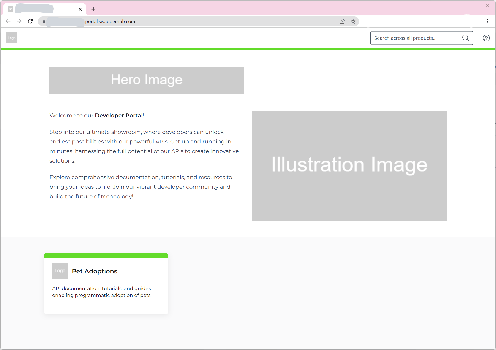

# Create and Publish New Product

The following section describes how to create and publish a new product (i.e. an API product) to a SwaggerHub Portal instance directly via its APIs.

A product, in terms of SwaggerHub Portal, is a combination of metadata (a.k.a. _product settings_), API reference documents (e.g., an OpenAPI document), and Markdown documents.

The following table outlines the settings per product
| Setting Name | Description |
| ----------- | ----------- |
| `name` | The name of the product that will appear on the portal landing page (maximum length is 22 characters). |
| `slug` | The url segment to be appended to the portal URL to uniquely reference the product `https://<SUBDOMAIN>.portal.swaggerhub.com/<SLUG>`. |
| `description` | The product description that will appear on the landing page (maximum length is 110 characters). |
| `public` | Indicates whether or not the product is available publicly (i.e., to non-members of the SwaggerHub organization linked to the portal instance). Defaults to `false`. |
| `hidden` | Indicates whether or not the product will be displayed on the portal landing page. Defaults to `false` (so product is visible on landing page by default). |
| `logoId` | A reference to the logo attachment. *Note*  A _logo_ must be 64x64 pixels, have a `.jpg`, `.gif`, or `.png` file format, and be less than 5MB in size. |

### Create Product
This section describes how to create a product and set the main product settings.

A new product can be created via a `POST` request to the `/products` endpoint. Below is a sample `cURL` request, which creates a product with the base settings populated, and sets the visibility to _private_.

> don't forget to replace the placeholder values with the real values
```
curl --location --request POST 'https://api.portal.swaggerhub.com/v1/products' \
--header 'Authorization: Bearer <YOUR-SWAGGERHUB-APIKEY>' \
--header 'Content-Type: application/json' \

--data '{
  "portalId": "<PORTAL-ID>",
  "name": "Pet Adoptions",
  "description": "API documentation, tutorials, and guides enabling programmatic adoption of pets",
  "slug": "pet-adoptions",
  "public": false,
  "hidden": false
}'
```

Sample response body:
```
{
  "id": "62a07233-3bbe-4008-b6aa-4f4e732352d5"
}
```

> **note** keep note of the returned `id` for the products, as it will be needed for later API calls

### Add Product Logo
Products can also have a _logo_. To create a logo, leverage the `/attachments/branding/{portalId}` endpoint and `POST` the binary file data. This is the same process as creating the image files for the _portal settings_.

> Don't forget to replace the placeholders in the sample request with real values
Sample cURL request to create the logo file:
```
curl -X POST -H "Content-Type: image/png" --data-binary "@logo.png" https://api.portal.swaggerhub.com/v1/attachments/branding/<YOUR-PORTALID>?name=<IMAGE-NAME> \
--header 'Authorization: Bearer <YOUR-SWAGGERHUB-APIKEY>'
```

Now that the logo has been created, issue a `PATCH` request to the `/products/{productId}` and set the logoId branding info. This will add the logo to the product.

Sample cURL request to update a product and set the logoId
```
curl --location --request PATCH 'https://api.portal.swaggerhub.com/v1/products/<PRODUCT-ID>' \
--header 'Authorization: Bearer <YOUR-SWAGGERHUB-APIKEY>' \
--header 'Content-Type: application/json' \

--data '{
  "branding": {
    "logoId": "<LOGO-ID>"
  } 
}'
```

After updating the product settings, the published portal now looks as follows:


